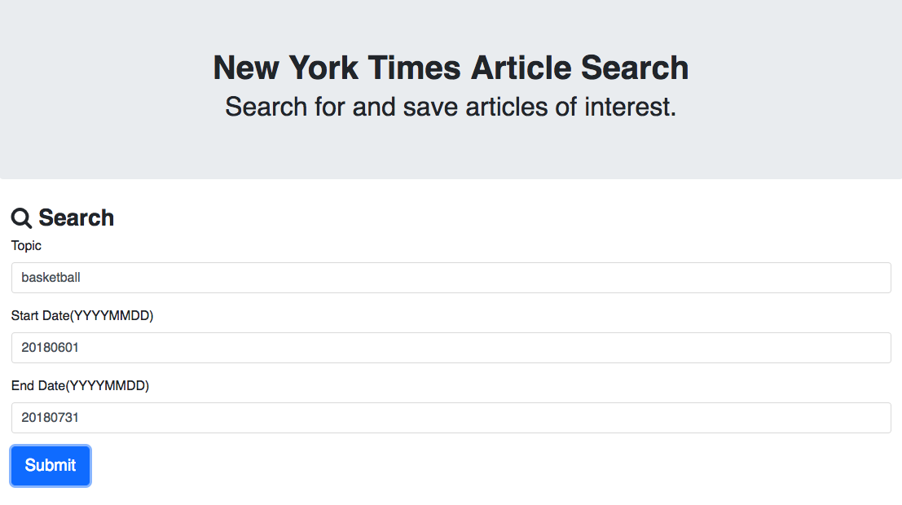
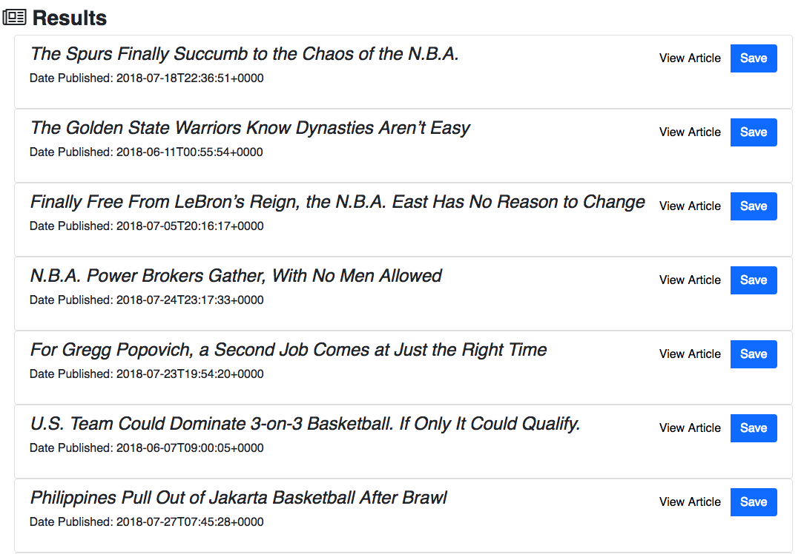
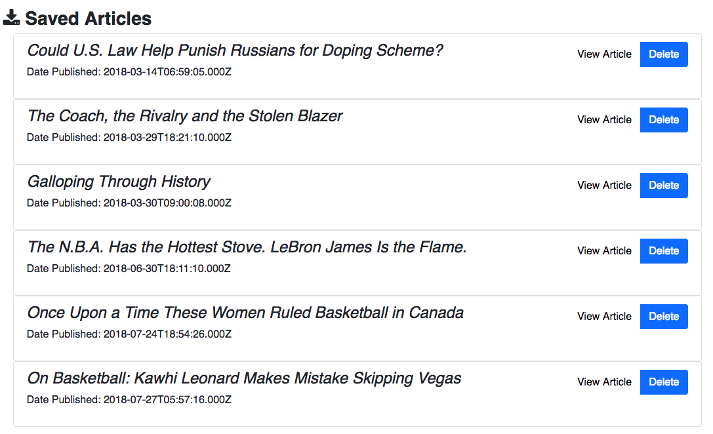

## React-NYT-search

A React application that uses the New York Times Article Search API to retrieve news articles by topic and date.

This project was bootstrapped with Create React App.

You can find the most recent version of this guide [here](https://morning-earth-24662.herokuapp.com/).

### Dependencies

1. express
2. mongoose
3. body-parser
4. bluebird
5. axios
6. react
7. react-dom
8. react-router-dom
9. react-scripts
